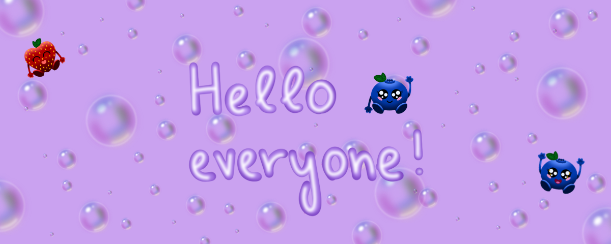

<h1 align="center">
    Let's connect!
</h1>
<p align="center">
    <a href="https://www.linkedin.com/in/zala-lahovnik-2a94b1272/">
        
    </a>
    <a href="mailto:zala.lahovnik@gmail.com">
        
    </a>
</p>


## 👩🏼‍💻 &nbsp;A little bit about me and my interests

```yaml
name: Zala Lahovnik
located_in: Maribor, Slovenia
current_job: Professional worker in higher education [Full Stack Developer]
education:
  [
    "#TODO: Master of Science in Information Technology and Data Engineering"
    "Bachelor of Science in Information Technology and Communication Technologies (UN)",
  ]

fields_of_interests:
  [
    "Web Development",
    "Data Science",
    "Machine Learning",
    "UI/UX",
    "MLOps",
    "DevOps",
  ]
technical_background:
  [
    "Frontend Developer",
    "Backend Developer",
    "Full-stack Developer",
    "MLOps Developer",
    "Machine Learning Developer",
  ]
  
currently_using: ["JavaScript", "React.js", "Python", "FastAPI", "Docker"]
hobbies: ["Gaming 🎮", "Digital art 🎨", "Content creation 🎥", "Video editing 🎞️", "Reading 📚", "Gym 🏃🏼‍♀️"]
```


## 💻 &nbsp;Some tools I have used and learned


## 📈 GitHub history

[](https://github.com/anuraghazra/github-readme-stats)


